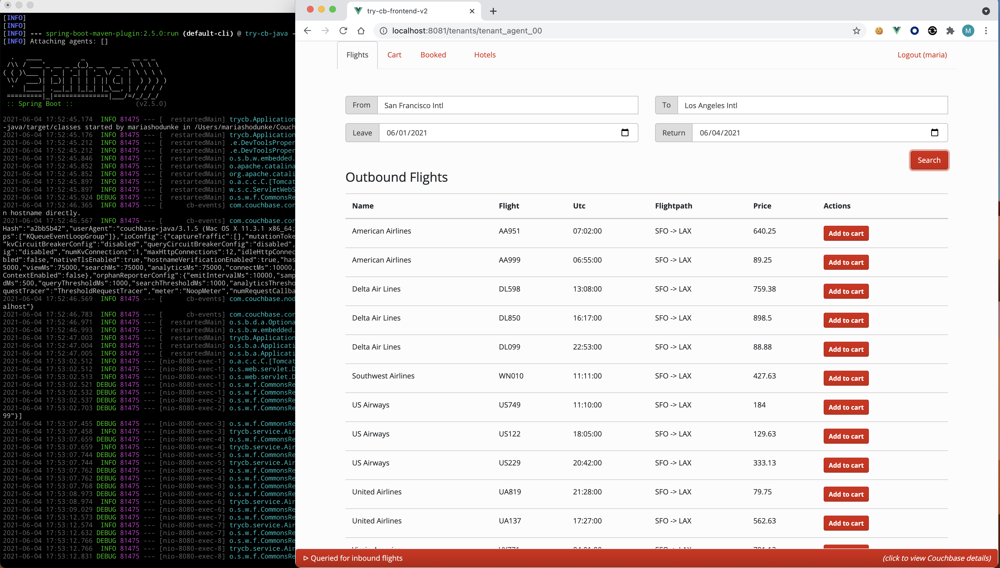

# Couchbase Spring Data Couchbase Travel-Sample Application

이 소스는 https://github.com/couchbaselabs/try-cb-spring 에서 가져와서 보완한 것입니다.  
2025년 3월 기준으로 최신 버전(pom.xml)을 반영하였습니다.  
최신화 과정에서 보안 관련 소스 코드는 일부 변경되었고,  
로컬 호스트에서 Springboot와 Vue.JS를 전부 구동시키기 위해 CORS 관련 부분도 변경되었습니다. 

이 소스는 [Couchbase Server]와 Springboot로 만든 샘플 애플리케이션입니다.
카우치베이스 DB의 문서(Json)용 SQL++, 서브-도큐먼트 요청 및 자연어 텍스트 검색(FTS) 쿼리 기능을 시연하기 위한 단일 페이지 웹 UI를 실행합니다. 
이 애플리케이션은 1) Couchbase Server와 2) [Springboot] 웹 프레임워크, API 문서화를 위한 [Swagger], 3)[Vue], 그리고 [Bootstrap]로 구성되어 있습니다.

이 애플리케이션은 사용자가 공항과 날짜를 기반으로 항공편 경로를 검색하고 구매할 수 있는 비행 계획 도구입니다. 공항 선택은 서버 측 SQL++ 쿼리에 연결된 자동 완성 상자를 통해 동적으로 이루어집니다. 
날짜 선택 후에는 데이터베이스에서 적합한 항공편 경로를 검색합니다. 추가 페이지에서는 비구조화된 키워드를 사용하여 호텔을 검색할 수 있습니다.

## Prerequisites

   아래와 같이 애플리케이션을 다운로드 하세요
   
      $ mkdir travel-app
      $ cd travel-app
      $ git clone https://github.com/unixfree/try-cb-spring.git
      $ git clone https://github.com/unixfree/try-cb-frontend-v2.git

      이 애플리케이션은 Docker로 실행할 수 있으나, 
      DB(Couchabse), Backend(Flask), Frontend(Vue)를 각각 구성, 수행하는 방법을 따릅니다.

## 1) Configure & Run Couchabse Server

   로컬 Labtop(Windows,MacBook)에 설치 할 수도 있고, Linux 서버에 설치형, 완전 구독형 Capella(DBaaS), Docker Container로 구성할 수 있습니다.  
 
   여기에서는 로컬 Labtop(Windows,MacBook)에 설치하는 구성으로 설명하겠습니다. 
   아래 페이지를 참고 하십시오. . 
   https://docs.couchbase.com/server/current/install/install-package-windows.html   
   https://docs.couchbase.com/server/current/install/macos-install.html   
   
   a) [카우치베이스 다운로드 사이트]에서 Windows,MacBook 용 Couchbase를 다운 받아서 설치하세요. 
      ID/PW 를 " Administrator / password " 로 구성하세요. 
   b) 설치 후, "Setting" > "Sample Buckets" 페이지에서 travel-sample 를 선택 후 "Load Sample Data" 를 클릭하세요. 
   c) 아래와 같이 FTS(FullTextSearch) 서비스의 검색 기능을 활용하기 위해 아래와 같이 검색 인덱스를 생성하세요 
   
      $ cd try-cb-spring
      $ curl -s -u Administrator:password -X PUT http://127.0.0.1:8094/api/index/hotels-index \
        -H 'cache-control: no-cache' -H 'content-type: application/json' \
        -d @fts-hotels-index.json
        
## 2) Configure & Run Backend(Spring Boot) Server
 
   a) 환경 변수 확인  
   
      $ cd try-cb-spring
      $ more src/main/resources/application.properties

   b) Couchbase DB가 잘 설치되었는지, FTS 검색 인덱스가 정상 생성되었는지 확인.
   
      $ export CB_HOST=localhost CB_USER=Administrator CB_PSWD=password
      $ ./wait-for-couchbase.sh echo "Couchbase is ready!"
      
   c) mvn 으로 클린 빌드 설치  
   
      $ mvn clean install
      
   d) Spring Boot AppServer 구동 
   
      $ java -jar target/try-cb-spring.jar --server.port=8080 --spring.config.location=file:src/main/resources/application.properties

## 3) Configure & Run Frontend(Vue) Server

   참고 : Backend(Springboot AppServer)와 다른 터미널에서 수행. 
   
   a) 구동을 위해 필요한 환경 구성 
   
      $ cd try-cb-frontend-v2
      $ npm install
      $ npm audit fix --force (optional)
      
   b) Vue 구동 
   
      $ npm run serve

## 4) Start Demonstration

   DB(Couchbase)는 http://localhost:8091 로 접속하고,  
   Backend(SpringBoot)는 http://localhost:8080,  
   Frontend(Vue)는 http://localhost:8081로 접속합니다. 
 
   http://localhost:8081 로 접속 후, 계정 하나를 등록(Register) 하고 항공 스케줄 검색/예약/구매 및 호텔 검색을 수행할 수 있습니다. 
 

## REST API reference

We've integrated Swagger/OpenApi version 3 documentation which can be accessed on the backend at `http://localhost:8080/apidocs`

[Couchbase Server]: https://www.couchbase.com/
[Java SDK]: https://docs.couchbase.com/java-sdk/current/hello-world/overview.html
[Spring Boot]: https://spring.io/projects/spring-boot
[Java]: https://www.java.com/en/
[Swagger]: https://swagger.io/resources/open-api/
[Vue]: https://vuejs.org/
[Bootstrap]: https://getbootstrap.com/
